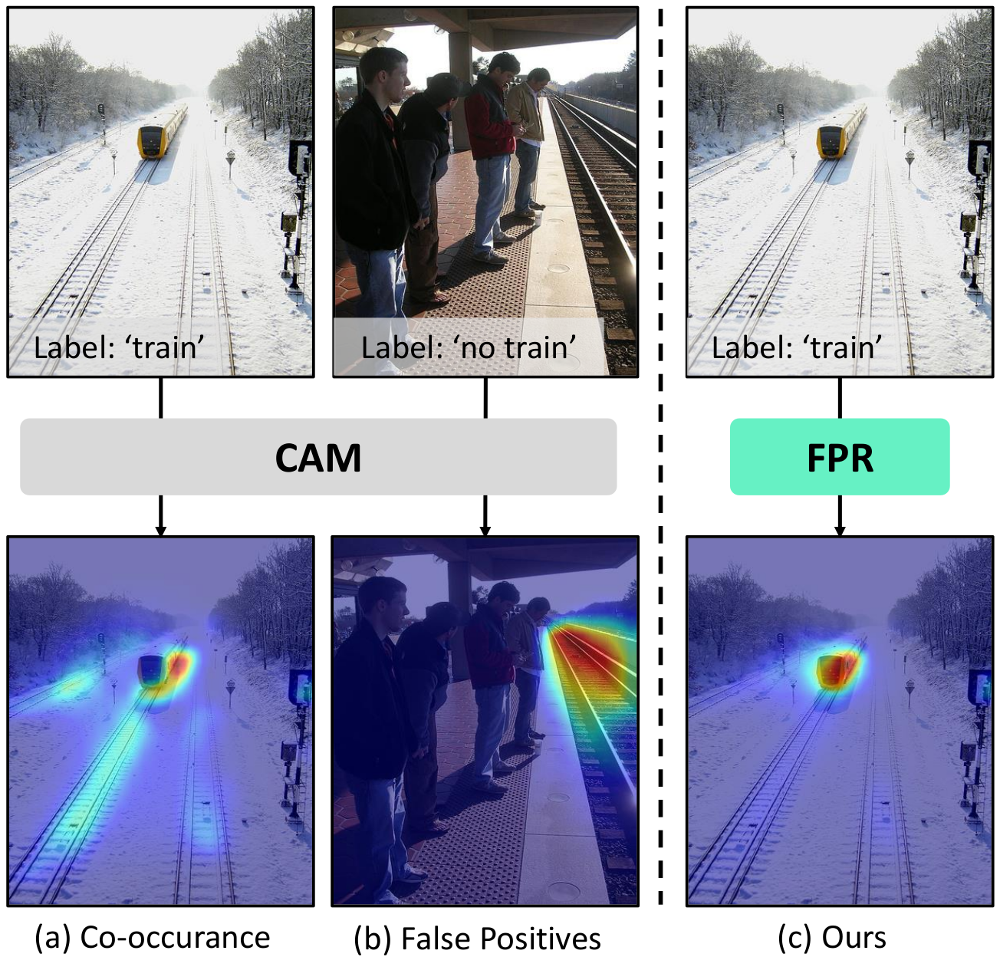
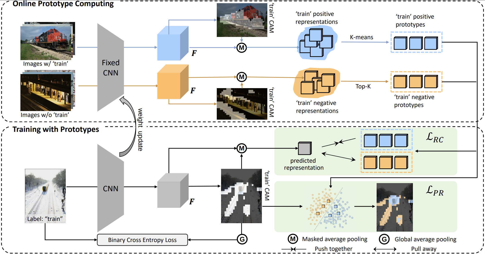

# FPR: False Positive Rectification for Weakly Supervised Semantic Segmentation [[pdf]](http://www4.comp.polyu.edu.hk/~cslzhang/paper/ICCV23-FPR.pdf)


# Method

<div style="text-align: center;">

</div>

The CAM in weakly supervised semantic segmentation suffers from over-activation from co-occurred background regions. Luckily, We observe that co-occurred background sometimes present in image solely and its cues can be easily captured through image-level labels. In detail, the framework is as follows, which insists of Online Prototype Computing and Training wht Prototype parts. 

<div style="text-align: center;">

</div>

# Get Start


## Environment
```
git clone https://github.com/mt-cly/FPR.git
conda create -n fpr python=3.8
conda activate fpr
cd ./FPR
pip install -r requirements.txt
```

## Datasets & Weights

1. Download the augmented [VOC12](http://host.robots.ox.ac.uk/pascal/VOC/voc2012/#data) & [COCO14](https://cocodataset.org/#download) and put them to the  `Dataset` folder.
2. Download the [CAM initial weight](https://drive.google.com/file/d/1FzPytZExLjJBB8od4kLHBYpX2uhD2BXy/view?usp=sharing) and place it to the `sess` folder.


## Run

```
python run_sample.py
```

The trained fpr weight and log are available: [[res50_fpr.pth]](https://drive.google.com/file/d/14HRtcg75LmHcIQEw_k5rsnthVFeR6mKn/view?usp=sharing)  [[fpr.log]](https://drive.google.com/file/d/18g2x1ORtGP1U_F7pnSswWpsD4zwjzeih/view?usp=sharing)  

# TODO

* Release the COCO2014 part  code.

# Citation

```
@article{chen2023fpr,
  title={FPR: False Positive Rectification for Weakly Supervised Semantic Segmentation},
  author={Chen, Liyi and Lei, Chenyang and Li, Ruihuang and Li, Shuai and Zhang, Zhaoxiang and Zhang, Lei, Jinfeng and Zhang, Lei},
  booktitle={Proceedings of the IEEE/CVF international conference on computer vision},
  pages={},
  year={2023}
}